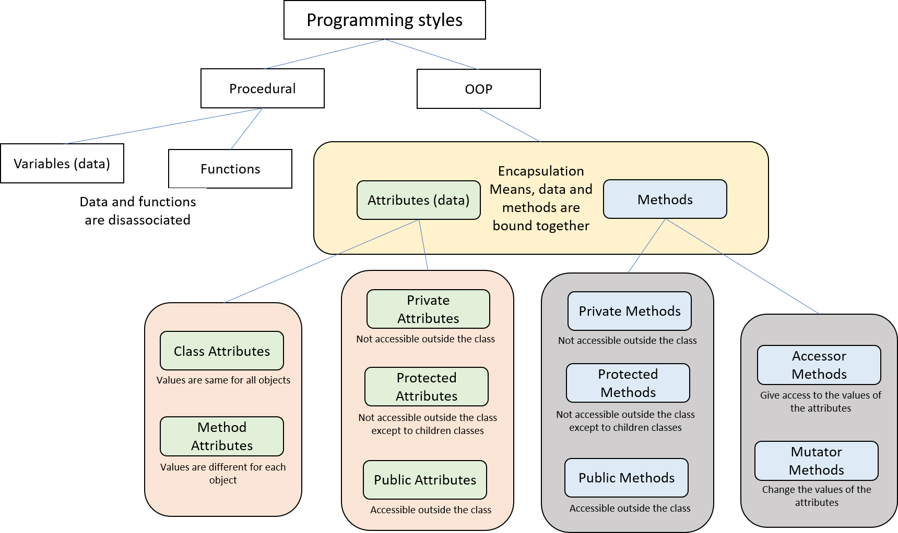

# Object Oriented Programming



# 10-1. Classes and Objects

Class is a description of an object’s characteristics  
An object is an instance of a class  
To create a class, we write a class definition.  
A class definition is a set of statements that define a class’s **data attributes** and **methods**

### 1a. Creating class
Class definition will always be at zero indent  

**Syntax:** class <class_name>():
```python
class student():
  pass
# Good coding convention is to start class name with uppercase character, so let's fix it
```

### 1b. Now we create the object of this class
Must do it OUTSIDE the class definition  

**Syntax:** <obj_name> = <class_name>()  

```python
student1 = Student()
```

<details>
  <summary>
    👉 Try this
  </summary>
  create a class named book
</details>

<details>
  <summary>
    👀 Answer
  </summary>
  class Book():<br>
  pass (put an indent before pass)
</details>


<details>
  <summary>
    👉 Try this
  </summary>
  create an object of the class book
</details>

<details>
  <summary>
    👀 Answer
  </summary>
  book1 = Book() (do this OUTSIDE the class definition)
</details>


# 10-3. init method
This is a built-in Python **initializer** method  
Any data when creating an object is initialized by this method  
This is usually the first method in a class  

**Syntax:**  
def \_\_init\_\_(self, \<other parameters\>):  

__Every method must have the first parameter variable named self__  

When a method executes, it must have a way of knowing which object’s data attributes it is supposed to operate on. That’s where the self parameter comes in. 
 
 When a method is called, Python makes the self parameter reference the specific object that the method is supposed to operate on.

<details>
  <summary>
    💡 Note:
  </summary>
  Methods are simply functions defined INSIDE a class
</details>

### 3a. Defining \_\_init\_\_
```python
def __init__(self, name, major):
  # init binds the name, major to self
  
  self.name = name  # public attribute
  self.major = major # public attribute

  # self.name = _name  # protected attribute
  # self.major = _major # protected attribute

  # self.__name = name  # private attribute
  # self.__major = major # private attribute
```

<details>
  <summary>
    🚩 To remember:
  </summary>
  Every method in a class must have the first parameter variable named self
</details>
### How to call the \_\_init\_\_ method?
\_\_init\_\_ is a private method, so we cannot access it from outside the class  
Only way to call it is by passing data when creating object
 
### 3b. Calling \_\_init\_\_

```python
student1 = Student("John", "CINS")
print(student1.name)
# student1 is an object of the class student
# student1 is passed as self
# name and major are bound to student1 in __init__

```
self.name and self.major are called method attibutes

<details>
  <summary>
    💡 Note:
  </summary>
  Method attibutes hold different values for different objects
</details>

```python
# Let's create another student
student2 = Student("Mia", "HIST")
print(student2.name)
```

OOP is specifically meant to disallow data manipulation from unintended code

```python
print(student1.name)
student1.name = "Joe"
print(student1.name)
```
To try to avoid this, we have to indicate the attributes are private by using leading and trailing \_\_  
*For the scope of this chapter, we will make all our method attributes private*  
Next chapter, we will use a combination of private and protected method attributes


```python
def __init__(self, name, major):
  self.__name = name
  self.__major = major
```

<details>
  <summary>
    👉 Try this
  </summary>
  Create an initializer method for the class book, to accept two parameters - t and p and bind to the self parameter as private attributes - title and price
</details>

<details>
  <summary>
    👀 Answer
  </summary>
  (Inside the class)<br>
  def __init__(self, t, p):<br>
    self.__title = t # use indent<br> 
    self.__price = p # use indent
</details>

<details>
  <summary>
    👉 Try this
  </summary>
  Create an object of the class book, named book1, with two arguments, Hunger Games, 15.75
</details>

<details>
  <summary>
    👀 Answer
  </summary>
  (Outside the class)<br>
  book1 = Book("Hunger Games", 15.75)
</details>

# 10-4. \_\_str\_\_ method
This is another private, built-in method  
Obviously, it is defined INSIDE the class  
It returns the state of the object    
Which means it can **return** any and all the attributes bound to self in a string format  
We can format this string in any way we choose
  
### 4a. Defining \_\_str\_\_ method
**Syntax:**  
def \_\_str\_\_(self):  
```python
def __str__(self):
  return f'{self.__name}, {self.__major}'
```

### 4b. Calling \_\_str\_\_ method
Since this is a private method, you cannot call it using the object name  
The only way to call it is by printing the object  

**Syntax:**  
print(<obj_name>)
```python
print(student1)
```

<details>
  <summary>
    👉 Try this
  </summary>
  Create an str method for the class book, to return the two parameters title and price in a pretty format
</details>

<details>
  <summary>
    👀 Answer
  </summary>
  (Inside the class)<br>
  def __str__(self):<br>
    return (f'Title: {self.__title}\nPrice: {self.__price}') # use indent<br> 
</details>


<details>
  <summary>
    👉 Try this
  </summary>
  Access the str method for the book using the book1 object
</details>

<details>
  <summary>
    👀 Answer
  </summary>
  (Outside the class)<br>
  print(book1) 
</details>

# User-defined methods

We have seen the built-in \_\_init\_\_ and \_\_str\_\_ methods. Now let us define our own methods

<details>
  <summary>
    💡 Just like attributes
  </summary>
  To make a method private, use __ as a prefix. Private methods cannot be called from outside the class.<br>
  To make a method protected, use _. We will see protected methods in the next chapter.<br> 
  To make a method public, don't use any leading _
</details>


# 10-5. Accessor Methods
These methods let us access the method attributes from outside the class.  
 When a method uses the self parameter to create an attribute, the attribute belongs to the specific object that self references  
 These are value-returning methods.

### 5a. Defining public accessor methods
Coding convention encourages to define accessor methods with the prefix **get**  
All method definitions will be INSIDE the class
  
```python
# Defining a public acessor method
def get_name(self):
  return self.__name
```

### 5b. Calling the public accessor methods
Method calls will be outside the class definition  
We must use the object name to call the method
  
```python
# Outside the class
student1.get_name()
```

<details>
  <summary>
    🚩 Notice
  </summary>
  From its definition, it looks like get_name accepts one argument<br>
  But when we are calling it the parantheses are empty<br>
In the background, Python is passing student1 as the argument
</details>

### 5c. Defining protected accessor methods
Method definitions will be INSIDE the class definition

```python
def _get_name(self):
  return self.__name
```


### 5d. Calling protected accessor methods
Method calls should be INSIDE children classes (we will see this in next chapter)  
For the scope of this class, we will not be using these


### 5e. Defining private accessor methods
Method definitions will be INSIDE the class definition

```python
def __get_name(self):
  return self.__name
```

### 5f. Calling private accessor methods
Method calls will be INSIDE the class definition  
For the scope of this class, we will not be using these (other than init and str)


<details>
  <summary>
    👉 Try this
  </summary>
  create a public accessor method named get_title and return private method attribute title that is bound to self in the class definition for book 
</details>

<details>
  <summary>
    👀 Answer
  </summary>
  Inside class definition of Book,<br>
  def get_title(self):
  return self.__title (use an indent before return)
</details>


<details>
  <summary>
    👉 Try this
  </summary>
  Obtain and print the title for book1 using the accessor method
</details>

<details>
  <summary>
    👀 Answer
  </summary>
  Outside class definition, after creating student1 object<br>
  print(book1.get_title())
</details>

# 10-6. Mutator Methods
These methods let us modify the attributes. These are void methods.

### a. Defining mutator methods
- Coding convention encourages to define mutator methods with the prefix **set**
- All method definitions will be INSIDE the class

  
```python
# Defining a public mutator method
def set_name(self, new_name):
  self.__name = new_name

# Defining a protected mutator method
def _set_name(self, new_name):
  self.__name = new_name

# Defining a private mutator method
def __set_name(self, new_name):
  self.__name = new_name
```
### b. Calling the public mutator methods
- Method calls will be outside the class definition
- We must use the object name to call the method
```python
# Outside the class
new_name = input("Enter the new name: ")
student1.set_name(new_name)

# @TODO - Print the name
# Hint: Must use the accessor method
```

### c. Calling the private mutator methods
- Method calls will be INSIDE the class definition, usually made by other methods.
- For the scope of this class, we will not be using these

<details>
  <summary>
    👉 Try this
  </summary>
  create a public mutator method named set_major and set the private method attribute major that is bound to self to the new major that the user passed
</details>

<details>
  <summary>
    👀 Answer
  </summary>
  Inside class definition,<br>
  def set_major(self, new_major):
  self.__major = new_major (use an indent)
</details>


<details>
  <summary>
    👉 Try this
  </summary>
  Set the major for student1 to HIST using the mutator method
</details>

<details>
  <summary>
    👀 Answer
  </summary>
  Outside class definition, after creating student1 object<br>
  student1.set_major("HIST"):
</details>


<details>
  <summary>
    🚩 Chapter Take away:
  </summary>
  1. Every method inside a class must have first parameter as self<br>
  2. To call any method, you must first create the object and use object to call that method
</details>

