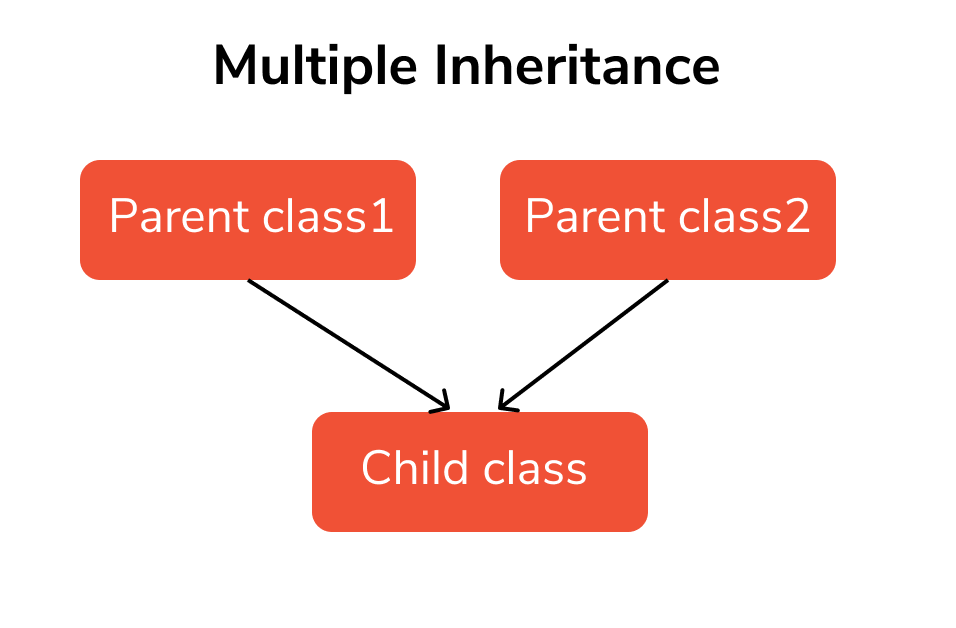

# Intro to Inheritance
- Inheritance allows a new class to extend an existing class. the new class inherits the members of the class it extends
- This is like a parent and child relationship.
- The child class (also called subclass or derived class) inherits all the properties of the parent class (superclass or base class) and can also have its own properties


## Why inheritance?
- When one object is a specialized version of another object, there is an "is a " relationship betweeen them.
- Through inheritance we can "clone" an existing class and all its attributes and methods and then add our own attrbiutes and methods

## For example:


- A college student has attributes name, major, classification and GPA
- If this student were to take the class CINS 3002, then in addition to name, major, classification, gpa he/she will have attributes to store the scores specific to this class, i.e.
  - video quiz
  - homework
  - exam
- So it makes no sense to create a class for CINS3002 student and repeat the attributes that are already stored by Student class
- Instead, a sub class or child of Student can be created which
  - "inherits" name, major, classification and gpa AND
  - can also define its own attributes (or methods)
- Similarly with CINS 3006, which has its own set of attributes

<details>
  <summary>
    🚩 To remember
  </summary>
  Through inheritance we can "clone" an existing class and all its attributes and methods and then add our own attrbiutes and methods<br>
The class we clone is called the parent (or super class) and the new class created is called a child (or sub class)
</details>


## Different types of inheritance
1. Single Inheritance - (parent-child)


2. Mutliple Inheritance - (parent-parent-child)


3. Multi-Level Inheritance - (parent-child-grandchild)

   

### Without inheritance

Let's look at two classes
  
```python
class Student():
  def __init__(self):
    print("This is Student init")

class CINS_Student(): 
  pass
```
- Let us create an object of Student
- init gets called and the print statement is executed
  
```python
student1 = Student()
```

Now let us create an object of CINS_Student

```python
cins = CINS_Student()
```

This class doesn't have an init method, so nothing is displayed

# 11-1. Single Inheritance

## a. Creating a child for an existing parent
In Python, a child is created by using parent class' name in parantheses


```python
class Student():
  def __init__(self):
    print("This is Student init")

class CINS_Student(Student): 
  pass

# CINS_Student is the child of Student
# Student is the Parent of CINS_Student
```

Let us create an object of Student (which is the parent)

```python
student1 = Student()
```

- Obviously, the parent's init gets called and the print statement is executed
- Now let us create an object of the child, which is CINS_Student

```python
# This class doesn't have an init method, so nothing must be displayed, BUT ... WAIT!!

cins = CINS_Student()
```
 
<details>
  <summary>
    🤓 Inference: 
  </summary>
  Because, there is a parent-child relationship, the child "inherited" the parent's init method!
</details>

# 2. Single Inheritance With Class Attributes

## Can we try with some attributes?
Create class attributes inside parent class

```python
class Student():
  college = "ULM" # I am a public class attribute
  _dept = "CINS" # I am a protected class attribute

class CINS_Student(Student): 
  pass
```

Let's access these attributes outside the class

```python
# Let's see parent behavior
student1 = Student()
print(student1.college)
print(student1._dept)
```

```python
# Let's see child behavior
cins_student1 = CINS_Student()
cins_student1.college
print(cins_student1._dept)
```

<details>
  <summary>
    👉 Inference: 
  </summary>
  The child inherited the parent's class attributes
</details>

# 3. Single Inheritance With Methods

## Let's add methods in parent class

Define the methods inside the class
```python
class Student():
  # public method
  def parent1(self):
    print("Parent1")

  # protected method
  def _parent2(self):
    print("Parent2")

class CINS_Student(Student): 
  pass
```

Call them outside the class
```python
# parent behavior
student1 = Student()
student1.parent1()
student1._parent2()
```

```python
# child behavior
cins_student = CINS_Student()
cins_student.parent1()
cins_student._parent2()
```

<details>
  <summary>
    🤓 Inference: 
  </summary>
  The child also inherited the parent's public and protected methods
</details>


# 4. Method Overriding (aka Polymorphism)

- Polymorphism allows subclasses to have methods with the same names as the methods in their superclasses.
- It gives the ability for a program to call the correct method depending on the type of object that is used to call it.

## 4a. Method overriding with init
Let's add an init to the child class definition

```python
class Student():
  def __init__(self):
    print("This is student init")

class CINS_Student(Student):
  pass
  # def __init__(self):
  #   print("This is CINS student init")

```

Call them outside the class
```python
student1 = Student()
cins_student = CINS_Student()

# Now uncomment the child's init and see what happens
```

<details>
  <summary>
    🤓 Inference: 
  </summary>
  When child has its own init, the parent's init is overridden and child uses its own init
</details>


## 4b. Let's add a method with same name to both parent and child

```python
class Student():
  def method1(self):
    print("This is student method1")

class CINS_Student(Student):
  def method1(self):
    print("This is CINS student method1")

student1 = Student()
student1.method1()

cins_student = CINS_Student()
cins_student.method1()

```

<details>
  <summary>
    🤓 Inference: 
  </summary>
  When child has a method with the same name of that of the parent, the parent's method is overridden
</details>


# 11-5. Child Accessing Parent's Methods Instead of Overriding

## What if child wants to access both its methods and the parent's methods too?
- We use a special method called super()
- super() can be used only INSIDE the child class

```python
class Student():
  def method1(self):
    print("This is student method1")

class CINS_Student(Student):
  def method1(self):
    super().method1()
    print("This is CINS student method1")

cins_student = CINS_Student()
cins_student.method1()
```

<details>
  <summary>
    💡 Note: 
  </summary>
  Instead of super, we can use the parent class name to call its methods inside the child class<br>
  But, we have to pass self as the first argument

  ```python
  class Student():
    def method1(self):
      print("This is student method1")

  class CINS_Student(Student):
    def method1(self):
      Student.method1(self) # accessing using parent's name
      print("This is CINS student method1")

  cins_student = CINS_Student()
  cins_student.method1()

  ```
</details>


<details>
  <summary>
    👉 11-5: Try This:
  </summary>
  
  In the above example
  - Write an init in the parent class and print `Hello`
  - From the child class' init method, call the parent init
</details>


<details>
  <summary>
    👀 Answer:
  </summary>

  ```python
class Student():
  def __init__(self):
    print("Hello")

class CINS_Student(Student):
  def __init__(self):
    super().__init__() # accessing the parent's init
    
cins_student = CINS_Student()
```
</details>

# 11-6. Parent's Access To Child's Methods (or attributes)


```python
class Student():
  def method1(self):
    print("This is student method1")

class CINS_Student(Student):
  def method2(self):
    print("This is CINS student method1")

cins = CINS_Student()
cins.method1()
cins.method2()

# Now uncomment these lines and see

# student = Student()
# student.method1()
# student.method2()

```

<details>
  <summary>
    🤓 Inference:
  </summary>
  In inheritance, child can access parent's attributes and methods but a parent cannot access a child's methods or attributes
</details>


# 7. Multi-Level Inheritance


- Grandchild class can access its own attributes, and both child and parent class' attributes and methods
- Child class can access its own and its parent's attributes and methods
- Parent class can access only its attributes and methods

## Creating multi-level inheritance

```python
class Parent():
  def __init__(self):
    print('Parent Init')

class Child(Parent):
  pass

class Grandchild(Child):
  pass
```

Now let's create objects and see how they behave

```python
p = Parent()
# c = Child()
# g = Grandchild()
```


# 11-8. Multiple Inheritance


For the scope of this class, we will not be going into this type of inheritance

